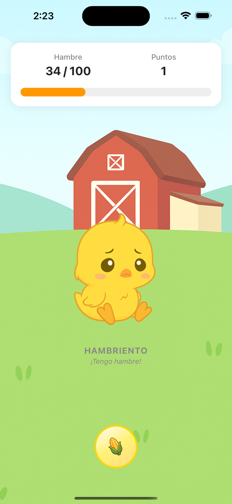
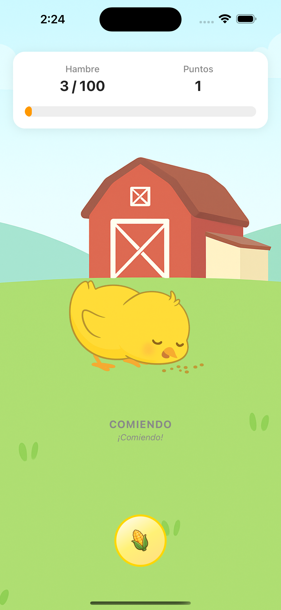
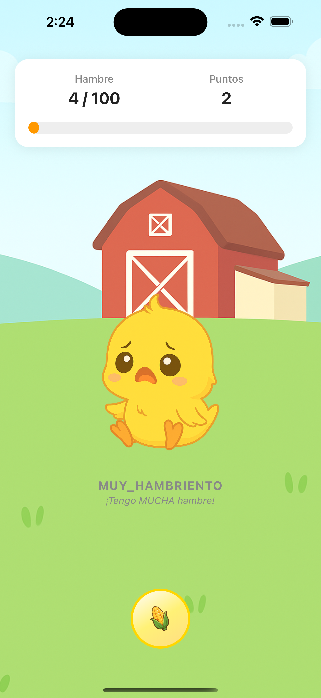
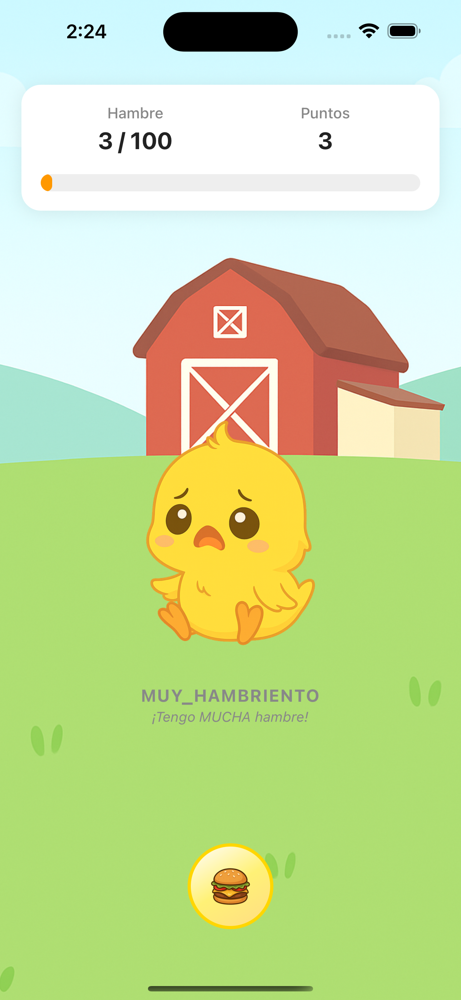
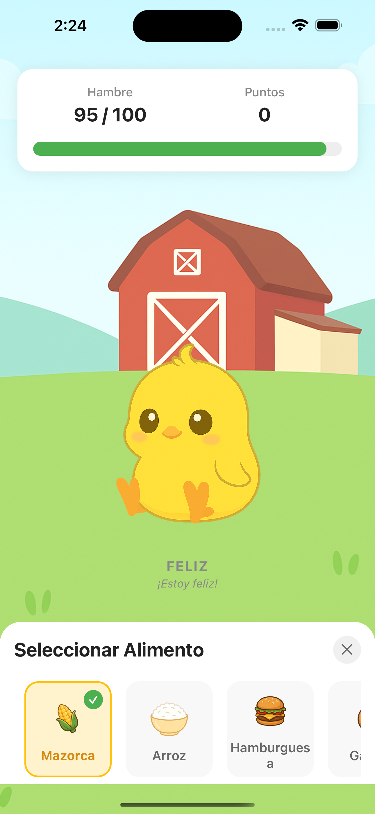

# 🐤 Pet Care App - Pollito Virtual

Una aplicación móvil desarrollada en **React Native con TypeScript** que simula el cuidado de un pollito virtual, inspirada en juegos como Talking Tom pero enfocada en la alimentación y supervivencia del pollito.

## 📱 Capturas de Pantalla

<div align="center">
  
  
  
</div>

<div align="center">
  
  
  
</div>

## 🎮 Características Principales

### 🐤 Sistema de Estados del Pollito
El pollito tiene **6 estados diferentes** que cambian según su nivel de hambre:

- **😊 Feliz**: Estado normal cuando está bien alimentado (hambre > 50%)
- **😋 Hambriento**: Cuando el hambre está entre 25-50%
- **🥵 Muy Hambriento**: Cuando el hambre está entre 0-25%
- **🍽️ Comiendo**: Durante 3 segundos después de alimentarlo
- **🟢 Lleno**: Cuando alcanza el máximo de hambre (100%) + tiempo de digestión
- **💀 Muerto**: Cuando el hambre llega a 0%

### 🍽️ Sistema de Alimentación Estratégico
- **5 tipos de comida** con diferentes valores nutricionales:
  - 🌽 Mazorca: +4 hambre
  - 🍚 Arroz: +5 hambre  
  - 🍔 Hamburguesa: +9 hambre
  - 🍪 Galleta: +6 hambre
  - 🍉 Sandía: +7 hambre

### ⏰ Sistema de Digestión Inteligente
- **Tiempo aleatorio**: Cuando el pollito se llena, tarda un tiempo aleatorio entre **0-59 minutos** antes de empezar a bajar el hambre
- **Cuenta regresiva visual**: Muestra el tiempo restante hasta la próxima comida
- **Persistencia**: El estado se mantiene incluso si la app se cierra

### 🎯 Interfaz Interactiva
- **Botón de alimentar arrastrable**: 
  - Arrastrar hacia arriba para alimentar
  - Arrastrar horizontalmente para cambiar comida
  - Arrastrar hacia abajo para abrir modal de selección
- **Barra de hambre dinámica**: Cambia de color según el nivel (verde → naranja → rojo)
- **Sistema de puntos**: Ganas puntos cada vez que alimentas al pollito

## 🏗️ Arquitectura del Proyecto

### 📁 Estructura de Carpetas
```
src/
├── components/        # Componentes React
│   ├── FeedButton.tsx
│   ├── FoodSelectionModal.tsx
│   ├── HungerBar.tsx
│   ├── PollitoArea.tsx
│   └── PollitoView.tsx
├── context/          # Estado Global (Context API)
│   ├── FoodContext.tsx
│   └── PollitoContext.tsx
├── hooks/           # Hooks personalizados
│   └── useInterval.ts
├── screens/         # Pantallas
│   └── HomeScreen.tsx
└── types/           # Tipos TypeScript
    └── pollito.ts
```

### 🔧 Tecnologías Utilizadas
- **React Native** con TypeScript
- **Expo** para desarrollo rápido
- **React Native Reanimated** para animaciones fluidas
- **React Native Gesture Handler** para gestos táctiles
- **AsyncStorage** para persistencia de datos
- **Context API** para manejo de estado global

## 🚀 Instalación y Uso

### Prerrequisitos
- Node.js (versión 16 o superior)
- npm o yarn
- Expo CLI
- Expo Go app en tu dispositivo móvil

### Pasos de Instalación

1. **Clonar el repositorio**
   ```bash
   git clone <url-del-repositorio>
   cd pet-care
   ```

2. **Instalar dependencias**
   ```bash
   npm install
   # o
   yarn install
   ```

3. **Ejecutar la aplicación**
   ```bash
   npm start
   # o
   yarn start
   ```

4. **Usar en dispositivo/simulador**
   - Escanea el código QR con Expo Go
   - O presiona 'i' para iOS o 'a' para Android

## 🎯 Mecánicas de Juego

### 🕐 Sistema de Tiempo Real
- **Decremento automático**: El hambre disminuye 1 punto por segundo
- **Persistencia inteligente**: Si la app estuvo cerrada, calcula cuánto hambre perdió el pollito
- **Digestión aleatoria**: Tiempo variable antes de que pueda tener hambre nuevamente

### 🏆 Sistema de Puntuación
- **Puntos por alimentación**: +1 punto cada vez que alimentas al pollito
- **Estrategia**: Diferentes comidas dan diferentes cantidades de hambre
- **Supervivencia**: El objetivo es mantener al pollito vivo el mayor tiempo posible

### 🎮 Controles Intuitivos
- **Tap simple**: Para alimentar rápidamente
- **Drag & Drop**: Para interacciones más complejas
- **Gestos**: Cambiar comida y abrir modales con gestos naturales

## 📊 Características Técnicas

### 🔄 Estado Global
- **PollitoContext**: Maneja el estado del pollito, hambre, puntos y lógica de alimentación
- **FoodContext**: Gestiona la selección de tipos de comida
- **Persistencia**: Guardado automático del estado en AsyncStorage

### 🎨 Interfaz de Usuario
- **Diseño minimalista** con fondo azul claro
- **Animaciones fluidas** para transiciones de estado
- **Responsive design** que se adapta a diferentes tamaños de pantalla
- **Feedback visual** inmediato para todas las acciones

### 🔧 Optimizaciones
- **Rendimiento**: Uso de useCallback y useMemo para optimizar re-renders
- **Memoria**: Limpieza automática de timers y listeners
- **Batería**: Actualización eficiente del estado cada segundo

## 🤝 Contribuir

¡Las contribuciones son bienvenidas! Si quieres contribuir al proyecto:

1. Fork el repositorio
2. Crea una rama para tu feature (`git checkout -b feature/AmazingFeature`)
3. Commit tus cambios (`git commit -m 'Add some AmazingFeature'`)
4. Push a la rama (`git push origin feature/AmazingFeature`)
5. Abre un Pull Request

## 📄 Licencia

Este proyecto está bajo la Licencia MIT. Ver el archivo `LICENSE` para más detalles.

## 👨‍💻 Autor

Desarrollado con ❤️ usando React Native y TypeScript.

---

**¡Disfruta cuidando de tu pollito virtual! 🐤✨** 